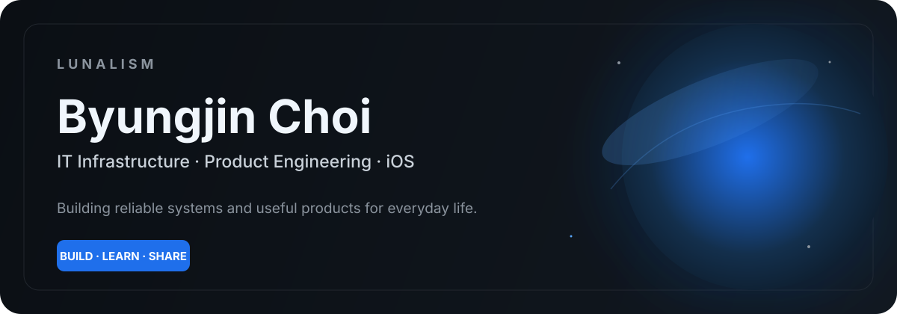
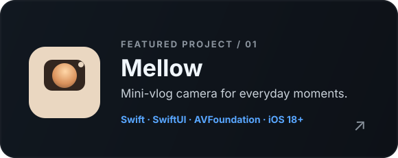
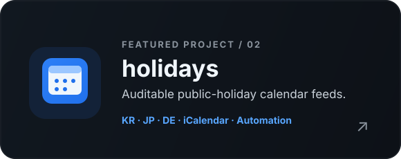

 

 

 

### `01 / PROFILE`

<table>
<tr>
<td width="65%" valign="top">

## Build useful things. Keep the complexity underneath.

I work across **IT infrastructure, operations, and product engineering** — from dependable systems behind the scenes to small products people can simply enjoy using.

Right now, most of my personal work sits around **iOS, automation, data, and practical everyday tools**.

</td>
<td width="35%" valign="top">

**FOCUS**

`iOS` · `SwiftUI`  
`Infrastructure` · `Networking`  
`Automation` · `Product`  
`Open Data` · `UX`

</td>
</tr>
</table>

 

### `02 / FEATURED PROJECTS`

<table>
<tr>
<td width="50%" align="center">

</td>
<td width="50%" align="center">

</td>
</tr>
</table>

 

### `03 / TOOLBOX`

 

### `04 / ACTIVITY`

 

 

### `05 / MORE FROM THE LAB`

[**Weather ↗**](https://github.com/lunalism/Weather) &nbsp;·&nbsp;
[**timekeeping ↗**](https://github.com/lunalism/timekeeping) &nbsp;·&nbsp;
[**noise ↗**](https://github.com/lunalism/noise) &nbsp;·&nbsp;
[**haileelog ↗**](https://github.com/lunalism/haileelog)

 

---

<strong>LUNALISM</strong> · reliable systems / useful products / continuous learning

