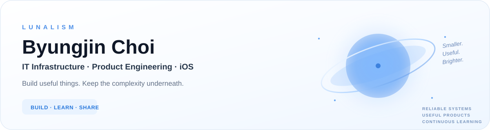

 

 

 

### `01 / PROFILE`

<table>
<tr>
<td width="65%" valign="top">

## Build useful things. Keep the complexity underneath.

I work across **IT infrastructure, operations, and product engineering** — from dependable systems behind the scenes to small products people can simply enjoy using.

Right now, most of my personal work sits around **iOS, automation, data, and practical everyday tools**.

</td>
<td width="35%" valign="top">

**FOCUS**

`iOS` · `SwiftUI`  \
`Infrastructure` · `Networking`  \
`Automation` · `Product`  \
`Open Data` · `UX`

</td>
</tr>
</table>

 

### `02 / FEATURED PROJECTS`

<table>
<tr>
<td width="50%" valign="top">

### &nbsp;[Mellow](https://github.com/lunalism/Mellow)

&nbsp;**Mini-vlog camera for everyday moments.**  
&nbsp;Record short clips, lightly arrange and trim them, preview the result, and export a finished video.

&nbsp;`Swift` · `SwiftUI` · `AVFoundation` · `iOS 18+`

 

</td>
<td width="50%" valign="top">

### &nbsp;[TSUGINO](https://github.com/lunalism/TSUGINO)

&nbsp;**A calm railway journey companion for Japan.**  
&nbsp;Keep the next station, remaining stops, and journey progress glanceable through Live Activities, Dynamic Island, and the Lock Screen.

&nbsp;`Swift` · `SwiftUI` · `ActivityKit` · `WidgetKit` · `iOS 18+`

 

</td>
</tr>
<tr>
<td colspan="2" valign="top">

### 📅 [holidays](https://github.com/lunalism/holidays)

**Auditable public-holiday calendar feeds for South Korea, Japan, and Germany.**  
Rule- and source-aware iCalendar feeds with automated generation, regional calendars, and KR/JP comparison feeds.

`iCalendar` · `Automation` · `Open Data` · `KR · JP · DE`

</td>
</tr>
</table>

 

### `03 / TOOLBOX`

 

### `04 / ACTIVITY`

 

 

### `05 / MORE FROM THE LAB`

[**Weather ↗**](https://github.com/lunalism/Weather) &nbsp;·&nbsp;
[**timekeeping ↗**](https://github.com/lunalism/timekeeping) &nbsp;·&nbsp;
[**noise ↗**](https://github.com/lunalism/noise) &nbsp;·&nbsp;
[**haileelog ↗**](https://github.com/lunalism/haileelog)

 

---

<strong>LUNALISM</strong> · reliable systems / useful products / continuous learning

